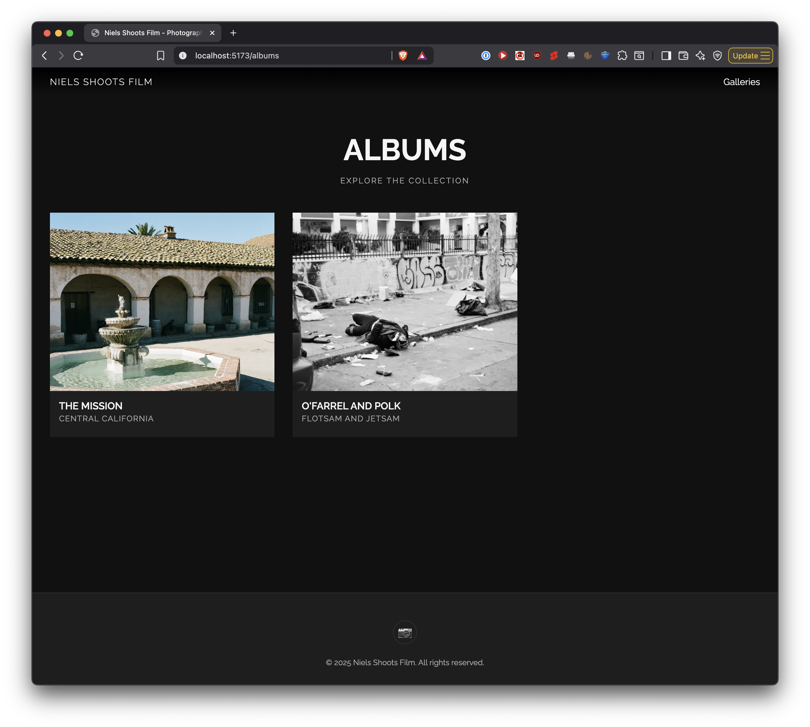
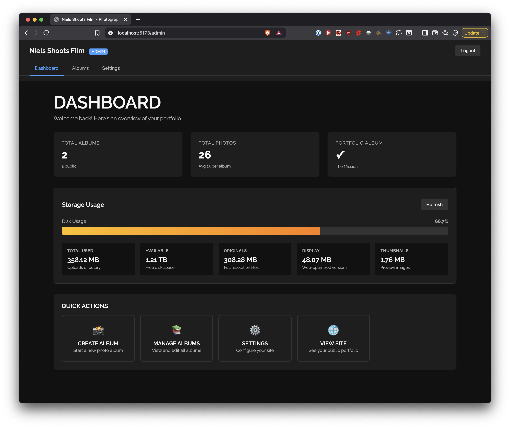

# Photography Portfolio & Gallery Website

**V1.0.0 Released!** See the [release notes](docs/releases/v1.0.0.md).

## What is this?

nielsshootsfilm.com is my personal photography portfolio website, a experiment in a novel hybrid static/dynamic website architecture, and, a playground for agentic AI supported development.

As a "product", this repository provides a modern photography portfolio with a unique hybrid static/dynamic architecture, designed for speed, simplicity, and ease of content management.





## The Unique Approach

**Hybrid Static/Dynamic Architecture:**

- **Public-facing site**: Pure static files (HTML, CSS, JS, JSON) served blazingly fast by any web server
- **Admin interface**: Dynamic Go backend for easy content management
- **No traditional database**: JSON files (`albums.json`, `site_config.json`) act as the data store
- **Result**: Fast visitor experience + simple content management + minimal hosting requirements

**Why This Works:**

- Visitors get instant page loads from static files
- Admin gets a user-friendly interface for managing albums and photos
- No database setup or maintenance needed
- Easy to back up (just copy JSON files)
- Can be hosted anywhere (GitHub Pages, Netlify, any web server)

## Tech Stack

- **Frontend**: TypeScript + Lit web components (~5KB), Vite for dev server
- **Backend**: Go admin server for JSON file manipulation
- **Build**: Simple shell scripts (frontend/scripts/, backend/scripts/)
- **Data**: JSON files as database
- **Testing**: Pre-commit hooks + manual E2E checklist (MVP)

## Development Philosophy

**Single Developer + Agentic AI:**
This project is developed by a solo developer working with AI agents (GitHub Copilot).

**Quality Standards:**

- Automated code quality checks via pre-commit hooks
- Type-safe TypeScript and Go

## Quick Start

### First-Time Setup (Automated)

Run the provisioning script to install all dependencies:

```bash
# Clone repository
git clone <repo-url>
cd nielsshootsfilm

# Run provisioning script (installs everything)
./provision.sh
```

The script installs:

- ✅ Node.js 20.x (frontend)
- ✅ Go 1.22+ (backend)
- ✅ Frontend npm packages
- ✅ Backend Go modules
- ✅ Pre-commit hooks
- ✅ Optional dev tools (golangci-lint, jq)

### Manual Setup (Alternative)

If you prefer manual installation:

```bash
# Install system dependencies (macOS)
brew install node@20 go@1.22 pre-commit golangci-lint

# Install project dependencies
cd frontend && npm install
cd ../backend && go mod download

# Install pre-commit hooks
pre-commit install

# Bootstrap project (create data files, set admin password)
./bootstrap.sh
```

### Environment Management with direnv (Optional but Recommended)

The project uses [direnv](https://direnv.net/) to automatically load environment variables and add scripts to your PATH when you enter the project directory.

**Setup direnv:**

```bash
# Install direnv
brew install direnv  # macOS
# or: sudo apt-get install direnv  # Linux

# Add hook to your shell (choose one):
echo 'eval "$(direnv hook zsh)"' >> ~/.zshrc   # for zsh
echo 'eval "$(direnv hook bash)"' >> ~/.bashrc # for bash

# Restart shell or reload config
source ~/.zshrc  # or ~/.bashrc
```

**Enable for this project:**

```bash
# In the project directory, allow direnv
direnv allow
```

**Benefits:**

- Scripts available from anywhere: `dev.sh`, `build.sh`, `format.sh`, etc.
- Automatic `env` file loading
- Project-specific environment variables

Without direnv, you'll need to run scripts with their full path (e.g., `./dev.sh` or `./scripts/test-api.sh`).

### Development

Run the development servers in two separate terminals:

```bash
# Terminal 1 - Frontend dev server with hot reload
./frontend/scripts/dev.sh

# Terminal 2 - Backend admin server with auto-reload
./backend/scripts/dev.sh
```

**Or use the convenience script (runs sequentially):**

```bash
./dev.sh
```

**Access:**

- Frontend: <http://localhost:5173>
- Backend API: <http://localhost:6180>
- Admin Interface: <http://localhost:5173/admin>

### Testing

Run tests using the unified test script:

```bash
# Run all unit tests (backend and frontend)
./test.sh

# Run specific test suites
./test.sh backend   # Backend unit tests only
./test.sh frontend  # Frontend unit tests only
./test.sh api       # API integration tests + schema validation

# Run specific backend tests
./test.sh -- backend/internal/handlers
./test.sh -- backend/...

# Run specific frontend tests
./test.sh -- storage-stats.test.ts
./test.sh -- frontend/src/components/storage-stats.test.ts

# Or run tests directly in each directory
cd backend && go test ./...
cd frontend && npm test
```

The test script automatically:

- Detects whether to run Go or npm tests based on the path
- Exits immediately after tests complete (no waiting for input)
- Provides colored output for easy scanning

## Architecture Overview

```text
┌─────────────────────────────────────┐
│   Public Website (Static Files)     │
│   - Portfolio page                   │
│   - Album galleries                  │
│   - Password-protected albums        │
└─────────────────────────────────────┘
              ▲
              │ Served by any web server
              │
┌─────────────────────────────────────┐
│   Admin Backend (Go Server)          │
│   - Album management (CRUD)          │
│   - Photo upload & processing        │
│   - JSON file manipulation           │
└─────────────────────────────────────┘
              ▲
              │ Reads/Writes
              ▼
┌─────────────────────────────────────┐
│   Data Layer (JSON Files)            │
│   - albums.json                      │
│   - site_config.json                 │
└─────────────────────────────────────┘
```

## Documentation

- [`provision.sh`](provision.sh) - **First-time setup script** (run this first!)
- [`docs/plan/PLAN_MVP.md`](docs/plan/PLAN_MVP.md) - Complete implementation plan
- [`docs/DEVELOPMENT_SETUP.md`](docs/DEVELOPMENT_SETUP.md) - Tool configurations
- [`scripts/README.md`](scripts/README.md) - Available utility scripts
- [`frontend/scripts/`](frontend/scripts/) - Frontend development scripts
- [`backend/scripts/`](backend/scripts/) - Backend development scripts

## Contributing

This is a personal project, but suggestions are welcome! Open an issue to discuss ideas.

## License

MIT License - See [LICENSE](LICENSE) file for details.
